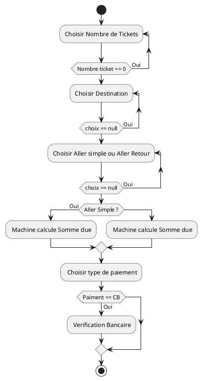
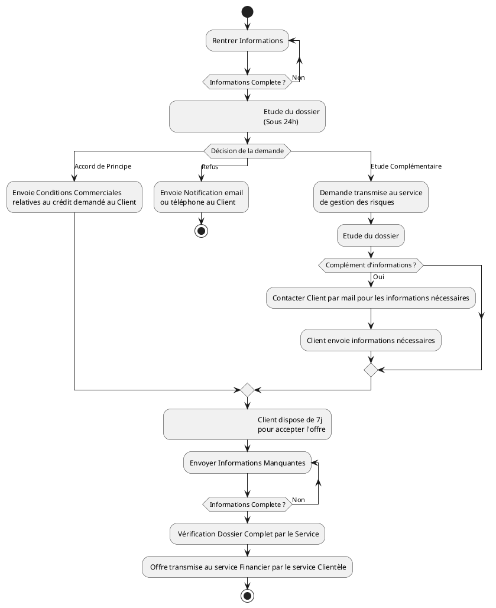

# Uml-learning

[PlantUML Image](https://www.plantuml.com/plantuml/dsvg/ZP1DImCn48Rl-HLpt1u4pqgnjbxzm8htc7sN7Pnya4nG_xqntI9OADxUCCyy4zvDKPkrUZ4zc8m4gtIrcoCNplGG_Li6ZQ0NTk_GSdr4FcOMqB00sgUqNjFbYhZGy5XvTMAxGr4ELZc6lnxNaC-V_L15pYXkHP2fi4y2YdLvFqDZpVzryaJ3OMz_yDpy3abd17D1zzRD743EYgiDsKVlGME5WHIS1yB8KoEENzQlr1jCbk4HjDz_ijnoRsotFJt_YimJkruLRMrmbZDCqPWMVO-RbgkNRm00)

[PlantUML Image](//www.plantuml.com/plantuml/dpng/dLBBRjH04BpxA_eMxo4NX8Iq6uMWx29n8469n8dBQARDDXhtEDqz6_57-3lyO_WnOXz2790FjbpJDTLLTQVcn78Rg_cZ4kpG6QoVa4rGu1CtILfdb5Wt1ONNFKM4-XI3-zHs4GtX_Gf8eNv8lAhMt-pux2m7X90X95L2gKx1-ZbbXJTlzwiDtDmOjRWx8DljRQMlP7uFzNReFIabXe0G7GHi7GTSLTufGlt1-oHXmhu8iQTkHDOxFYJ2KHi7-YEpHV7a8ceb69tH0HLS1Yz37yWAxz1F_-uZ8TkcNF64JTOZwqCoQiZF-yCuHB5A6Mpeuz1t-yHuog2Mka8p-x3uDVJjY3gIIUnsMGXC76jBEiyhoe4yLW7XEwejwoi8wKl6CP7rfQkRYXgeJzWXND5fK2MVnqmhi3rojHxjCUSDfQY5pWbC-q2Nia14XJC67fD0LKSoAoX3kBZoZvF8WPhvjMHwNez24qYxf3W5-Uu7d7LaLkEynsxI6gzIqmXUrgLKT0xfvqM1uRFZb-pOy3-wV0rVXrwEYMyNlylXnRI8y5m2kuR7KTxVquIFn8xzD5sc2b0267v5N1fpXnno6ty3)
