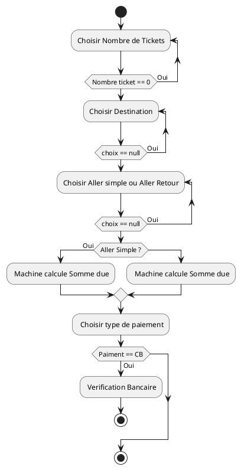

# Uml-learning

[PlantUML Image](https://www.plantuml.com/plantuml/dsvg/ZP1DImCn48Rl-HLpt1u4pqgnjbxzm8htc7sN7Pnya4nG_xqntI9OADxUCCyy4zvDKPkrUZ4zc8m4gtIrcoCNplGG_Li6ZQ0NTk_GSdr4FcOMqB00sgUqNjFbYhZGy5XvTMAxGr4ELZc6lnxNaC-V_L15pYXkHP2fi4y2YdLvFqDZpVzryaJ3OMz_yDpy3abd17D1zzRD743EYgiDsKVlGME5WHIS1yB8KoEENzQlr1jCbk4HjDz_ijnoRsotFJt_YimJkruLRMrmbZDCqPWMVO-RbgkNRm00)
